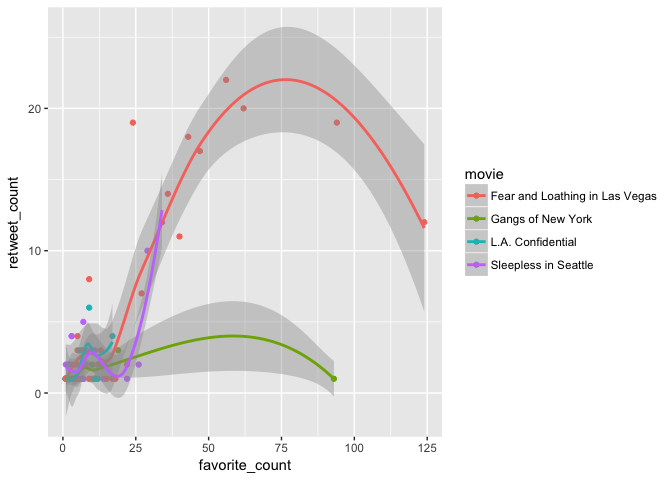
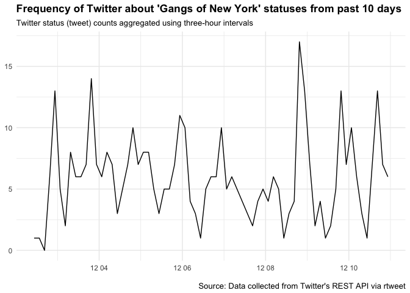
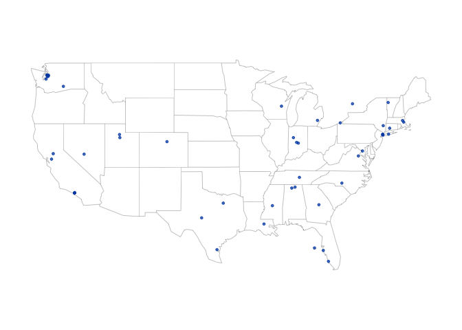
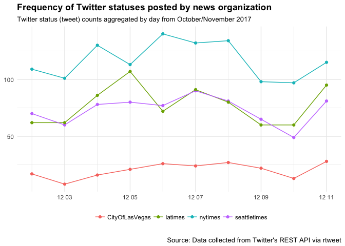
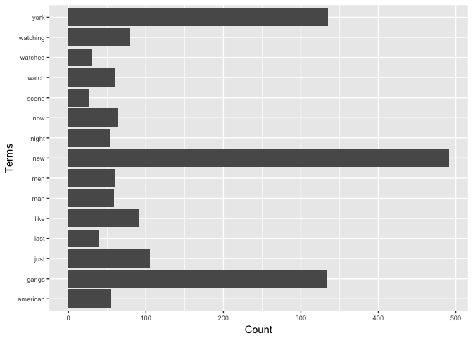

Search tweets about four movies
-------------------------------

``` r
library(rtweet)
```

    ## Warning: package 'rtweet' was built under R version 3.4.2

``` r
NY <- search_tweets(
  '"Gangs of New York"', n = 250000, retryonratelimit = TRUE,since='2017-12-01', until='2017-12-11')
```

    ## Searching for tweets...

    ## This may take a few seconds...

    ## Finished collecting tweets!

    ## Searching for tweets...

    ## This may take a few seconds...

    ## Finished collecting tweets!

``` r
Seattle <- search_tweets(
  '"Sleepless in Seattle"', n = 500000, retryonratelimit = TRUE,since='2017-12-01', until='2017-12-11'
)
```

    ## Searching for tweets...

    ## This may take a few seconds...

    ## Finished collecting tweets!

    ## Searching for tweets...

    ## This may take a few seconds...

    ## Finished collecting tweets!

``` r
LA <- search_tweets(
  '"L.A. Confidential"', n = 250000, retryonratelimit = TRUE,since='2017-12-01', until='2017-12-11'
)
```

    ## Searching for tweets...

    ## This may take a few seconds...

    ## Finished collecting tweets!

    ## Searching for tweets...

    ## This may take a few seconds...

    ## Finished collecting tweets!

``` r
LasVegas <- search_tweets(
  '"Fear and Loathing in Las Vegas"', n = 250000, retryonratelimit = TRUE,since='2017-12-01', until='2017-12-11'
)
```

    ## Searching for tweets...

    ## This may take a few seconds...

    ## Finished collecting tweets!

    ## Searching for tweets...

    ## This may take a few seconds...

    ## Finished collecting tweets!

Data Cleaning
-------------

``` r
library(dplyr)
```

    ## 
    ## Attaching package: 'dplyr'

    ## The following objects are masked from 'package:stats':
    ## 
    ##     filter, lag

    ## The following objects are masked from 'package:base':
    ## 
    ##     intersect, setdiff, setequal, union

``` r
library(ggplot2)
names(NY)
```

    ##  [1] "status_id"              "created_at"            
    ##  [3] "user_id"                "screen_name"           
    ##  [5] "text"                   "source"                
    ##  [7] "reply_to_status_id"     "reply_to_user_id"      
    ##  [9] "reply_to_screen_name"   "is_quote"              
    ## [11] "is_retweet"             "favorite_count"        
    ## [13] "retweet_count"          "hashtags"              
    ## [15] "symbols"                "urls_url"              
    ## [17] "urls_t.co"              "urls_expanded_url"     
    ## [19] "media_url"              "media_t.co"            
    ## [21] "media_expanded_url"     "media_type"            
    ## [23] "ext_media_url"          "ext_media_t.co"        
    ## [25] "ext_media_expanded_url" "ext_media_type"        
    ## [27] "mentions_user_id"       "mentions_screen_name"  
    ## [29] "lang"                   "quoted_status_id"      
    ## [31] "quoted_text"            "retweet_status_id"     
    ## [33] "retweet_text"           "place_url"             
    ## [35] "place_name"             "place_full_name"       
    ## [37] "place_type"             "country"               
    ## [39] "country_code"           "geo_coords"            
    ## [41] "coords_coords"          "bbox_coords"

``` r
##comine 4 datasets
NY["movie"] <- "Gangs of New York"
LA["movie"] <- "L.A. Confidential"
Seattle["movie"] <- "Sleepless in Seattle"
LasVegas["movie"] <- "Fear and Loathing in Las Vegas"
rawdata <- rbind(NY,LA,Seattle,LasVegas)

##select columns and filter columns

movies <- rawdata[, c("movie","user_id","text","source","favorite_count","retweet_count","lang","country","country_code","geo_coords","coords_coords","bbox_coords","created_at")] %>% filter(lang =='en') %>% filter(!is.na(text)) %>% as.data.frame()
```

Data Visulization
-----------------

``` r
## Show the realtionship between favourite count and retweet count for each movie
movies_by_name <- movies%>% group_by(movie)%>%filter(favorite_count !=0 & retweet_count !=0 &retweet_count<50)%>%arrange(favorite_count)

library(ggplot2)

ggplot(movies_by_name,aes(favorite_count,retweet_count,group = movie, colour = movie)) + geom_point()+geom_smooth(method = "loess")
```



``` r
##show 5 most popular tweet sources for each movie(use functions here)
popular_sources<- function(movie_name="Gangs of New York"){
   movies_by_source <- subset(movies,movie == movie_name)%>%
     group_by(source)%>%
     summarise(favorite_count=sum(favorite_count))%>%
     arrange(desc(favorite_count))%>% 
     head(5)%>%as.data.frame()
  movies_by_source$movie <- movie_name 
  return(movies_by_source)
}


popular_sources()
```

    ##                source favorite_count             movie
    ## 1  Twitter for iPhone            226 Gangs of New York
    ## 2  Twitter Web Client            148 Gangs of New York
    ## 3 Twitter for Android             60 Gangs of New York
    ## 4        Twitter Lite             28 Gangs of New York
    ## 5    Twitter for iPad             22 Gangs of New York

``` r
popular_sources(movie_name="Sleepless in Seattle")
```

    ##                source favorite_count                movie
    ## 1  Twitter for iPhone            338 Sleepless in Seattle
    ## 2 Twitter for Android            104 Sleepless in Seattle
    ## 3  Twitter Web Client             81 Sleepless in Seattle
    ## 4        Twitter Lite             18 Sleepless in Seattle
    ## 5              Buffer             16 Sleepless in Seattle

``` r
popular_sources(movie_name="L.A. Confidential")  
```

    ##                source favorite_count             movie
    ## 1  Twitter Web Client             80 L.A. Confidential
    ## 2 Twitter for Android             76 L.A. Confidential
    ## 3  Twitter for iPhone             70 L.A. Confidential
    ## 4           TweetDeck             16 L.A. Confidential
    ## 5    Twitter for iPad             11 L.A. Confidential

``` r
popular_sources("Fear and Loathing in Las Vegas")
```

    ##                source favorite_count                          movie
    ## 1  Twitter for iPhone            842 Fear and Loathing in Las Vegas
    ## 2        twittbot.net            280 Fear and Loathing in Las Vegas
    ## 3  Twitter Web Client            180 Fear and Loathing in Las Vegas
    ## 4        Twitter Lite            166 Fear and Loathing in Las Vegas
    ## 5 Twitter for Android             64 Fear and Loathing in Las Vegas

``` r
## plot time series of tweets about'Gangs of New York'
ts_plot(NY, "3 hours") +
  ggplot2::theme_minimal() +
  ggplot2::theme(plot.title = ggplot2::element_text(face = "bold")) +
  ggplot2::labs(
    x = NULL, y = NULL,
    title = "Frequency of Twitter about 'Gangs of New York' statuses from past 10 days",
    subtitle = "Twitter status (tweet) counts aggregated using three-hour intervals",
    caption = "\nSource: Data collected from Twitter's REST API via rtweet"
  )
```



Graphical Visualizations
------------------------

``` r
## create lat/lng variables using all available tweet and profile geo-location data
rt <- lat_lng(movies)

## plot state boundaries
par(mar = c(0, 0, 0, 0))
maps::map("state", lwd = .25)

## plot lat and lng points onto state map
with(rt, points(lng, lat, pch = 20, cex = .75, col = rgb(0, .3, .7, .75)))
```

 \#\#Get Timelines

``` r
## Get the most recent 3,200 tweets from cnn, BBCWorld, and foxnews
cities <- get_timelines(c("nytimes", "seattletimes ","CityOfLasVegas","latimes"), n = 3200)

## plot the frequency of tweets for each user since 2017-12-01
cities %>%
  dplyr::filter(created_at > "2017-12-01") %>%
  dplyr::group_by(screen_name) %>%
  ts_plot("days", trim = 1L) +
  ggplot2::geom_point() +
  ggplot2::theme_minimal() +
  ggplot2::theme(
    legend.title = ggplot2::element_blank(),
    legend.position = "bottom",
    plot.title = ggplot2::element_text(face = "bold")) +
  ggplot2::labs(
    x = NULL, y = NULL,
    title = "Frequency of Twitter statuses posted by news organization",
    subtitle = "Twitter status (tweet) counts aggregated by day from October/November 2017",
    caption = "\nSource: Data collected from Twitter's REST API via rtweet"
  )
```



Text Cleaning
-------------

``` r
library(tm)
```

    ## Warning: package 'tm' was built under R version 3.4.3

    ## Loading required package: NLP

    ## 
    ## Attaching package: 'NLP'

    ## The following object is masked from 'package:ggplot2':
    ## 
    ##     annotate

``` r
# build a corpus, and specify the source to be character vectors 
myCorpus <- Corpus(VectorSource(movies$text))
# convert to lower case
myCorpus <- tm_map(myCorpus, content_transformer(tolower))
# remove URLs
removeURL <- function(x) gsub("http[^[:space:]]*", "", x)
myCorpus <- tm_map(myCorpus, content_transformer(removeURL))
# remove anything other than English letters or space 
removeNumPunct <- function(x) gsub("[^[:alpha:][:space:]]*", "", x) 
myCorpus <- tm_map(myCorpus, content_transformer(removeNumPunct)) 
# remove stopwords
myStopwords <- c(setdiff(stopwords('english'), c("r", "big")),
                     "use", "see", "used", "via", "amp")
myCorpus <- tm_map(myCorpus, removeWords, myStopwords)
# remove extra whitespace
myCorpus <- tm_map(myCorpus, stripWhitespace)
myCorpusCopy <- myCorpus
tdm<- TermDocumentMatrix(myCorpus,
                            control = list(wordLengths = c(1, Inf)))
tdm
```

    ## <<TermDocumentMatrix (terms: 4835, documents: 2212)>>
    ## Non-/sparse entries: 24905/10670115
    ## Sparsity           : 100%
    ## Maximal term length: 43
    ## Weighting          : term frequency (tf)

Frequent Words
--------------

``` r
freq.terms <- findFreqTerms(tdm, lowfreq = 20)
freq.terms
```

    ##   [1] "gangs"        "last"         "new"          "night"       
    ##   [5] "now"          "watched"      "watching"     "york"        
    ##   [9] "scene"        "american"     "like"         "man"         
    ##  [13] "men"          "watch"        "just"         "movie"       
    ##  [17] "rt"           "want"         "will"         "daniel"      
    ##  [21] "day"          "good"         "film"         "ever"        
    ##  [25] "one"          "bill"         "im"           "dont"        
    ##  [29] "think"        "dead"         "favorite"     "love"        
    ##  [33] "movies"       "boys"         "us"           "next"        
    ##  [37] "story"        "today"        "great"        "seen"        
    ##  [41] "times"        "also"         "best"         "something"   
    ##  [45] "around"       "back"         "lets"         "never"       
    ##  [49] "youve"        "time"         "way"          "can"         
    ##  [53] "got"          "inception"    "take"         "zero"        
    ##  [57] "tonight"      "confidential" "la"           "lost"        
    ##  [61] "s"            "ive"          "isnt"         "right"       
    ##  [65] "old"          "live"         "people"       "get"         
    ##  [69] "o"            "find"         "made"         "return"      
    ##  [73] "video"        "youtube"      "christmas"    "club"        
    ##  [77] "e"            "sunshine"     "art"          "opening"     
    ##  [81] "death"        "thats"        "country"      "end"         
    ##  [85] "life"         "side"         "first"        "must"        
    ##  [89] "sunrise"      "psycho"       "rock"         "let"         
    ##  [93] "someone"      "ok"           "hard"         "young"       
    ##  [97] "thompson"     "alien"        "ark"          "raiders"     
    ## [101] "l"            "empire"       "vice"         "dialogue"    
    ## [105] "star"         "mail"         "ha"           "met"         
    ## [109] "escape"       "th"           "cant"         "remake"      
    ## [113] "curtis"       "hanson"       "w"            "sight"       
    ## [117] "hunter"       "lord"         "las"          "vegas"       
    ## [121] "ryan"         "better"       "seattle"      "sleepless"   
    ## [125] "sat"          "soul"         "connections"  "fans"        
    ## [129] "mariidora"    "spiritguides" "choice"       "release"     
    ## [133] "means"        "awake"        "fear"         "loathing"    
    ## [137] "nowplaying"   "tisifulabyce" "fearand"      "mission"     
    ## [141] "sim"          "raveup"       "album"        "vegasjust"   
    ## [145] "vegasscream"  "dance"        "falilv"       "grindhouse"  
    ## [149] "tour"         "acorofficial" "htt"          "previews"    
    ## [153] "depp"         "johnny"       "hnibofficial"

``` r
term.freq <- rowSums(as.matrix(tdm))
term.freq <- subset(term.freq, term.freq >= 20)
df <- data.frame(term = names(term.freq), freq = term.freq)%>%head(15)
library(ggplot2)
ggplot(df, aes(x=term, y=freq)) + geom_bar(stat="identity") +
  xlab("Terms") + ylab("Count") + coord_flip() +
  theme(axis.text=element_text(size=7))
```



``` r
m <- as.matrix(tdm)
m <- m %>%head(400)
# calculate the frequency of words and sort it by frequency w
word.freq <- sort(rowSums(m), decreasing = T)
```

Wordcloud
---------

``` r
library(wordcloud)
```

    ## Loading required package: RColorBrewer

``` r
wordcloud(words = names(word.freq), freq = word.freq, min.freq = 3,random.order = F)
```


